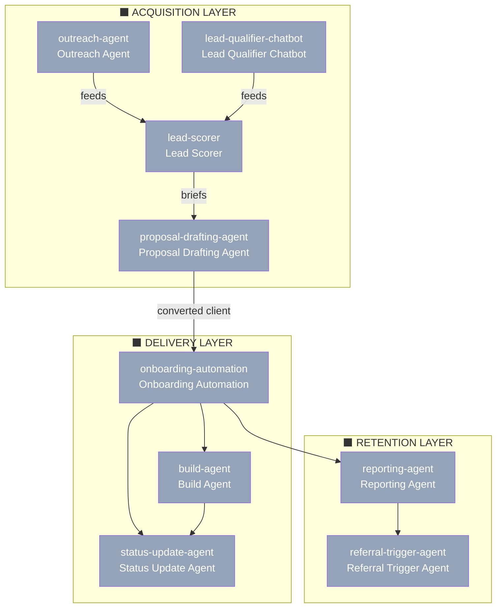

# Agent Map — Phoenix Automation

> Extracted from business-blueprint.json · 2026-03-13 · Schema v1.0.0

9 agents planned across 3 functional layers (acquisition, delivery, retention). 0 currently live. All agents are in `planned` status — build order is driven by revenue impact.

---

## Agent Ecosystem Diagram

**Status legend:** 🟢 live · 🟡 in_progress · ⬜ planned · 🔴 deprecated

---

## Agent Inventory

| ID | Name | Status | Role | Key Outputs | Depends On |
|----|------|--------|------|-------------|------------|
| `lead-qualifier-chatbot` | Lead Qualifier Chatbot | ⬜ planned | Qualifies inbound visitors 24/7, routes to Calendly or nurture | Qualification verdict, booking link or nurture message | — |
| `outreach-agent` | Outreach Agent | ⬜ planned | Writes personalised cold emails from Apollo data, queues in Instantly | Personalised email + 3-step follow-up sequence | — |
| `lead-scorer` | Lead Scorer | ⬜ planned | Pre-scores Typeform leads before assessment call | Lead score, owner pre-briefing, Airtable record update | — |
| `proposal-drafting-agent` | Proposal Drafting Agent | ⬜ planned | Drafts custom proposals from assessment call notes within 24 hrs | Notion proposal draft with automations, timeline, cost, ROI | `lead-scorer` |
| `onboarding-automation` | Onboarding Automation | ⬜ planned | Triggers full onboarding sequence on payment confirmation | ClickUp project, welcome email, API key collection, n8n workspace | `lead-scorer` |
| `build-agent` | Build Agent (Claude Code + n8n-MCP) | ⬜ planned | Builds, tests, and self-corrects n8n workflows from plain English | Live tested n8n workflow, self-corrected, owner-approved | — |
| `status-update-agent` | Status Update Agent | ⬜ planned | Sends weekly auto status updates to clients from ClickUp data | Weekly status email | `onboarding-automation` |
| `reporting-agent` | Reporting Agent | ⬜ planned | Auto-generates monthly performance reports from n8n execution data | Monthly report email to client | `onboarding-automation` |
| `referral-trigger-agent` | Referral Trigger Agent | ⬜ planned | Sends referral request sequence 30 days post-launch | 2–3 touch referral email sequence | `reporting-agent` |

---

## Agent Details

---

### Lead Qualifier Chatbot (`lead-qualifier-chatbot`)

**Status:** ⬜ planned
**Role:** Qualifies inbound website visitors 24/7 using Claude API, asks 3 screening questions, routes hot leads to Calendly and cold leads to a nurture response.

**Triggers:**
- Visitor clicks the chat bubble on the Phoenix Automation website

**Inputs:**
- Visitor message
- Answers to 3 qualification questions: industry, team size, biggest pain

**Outputs:**
- Qualification verdict (hot / cold)
- Calendly booking link for hot leads
- Nurture message for cold leads

**Tools:** Claude API (`claude-sonnet-4-6`), Calendly API, Website chat widget embed

**Depends on:** None

**Powers services:** `free-assessment`

**Definition:** [TO BE CREATED] `.claude/agents/lead-qualifier-chatbot.md`

---

### Outreach Agent (`outreach-agent`)

**Status:** ⬜ planned
**Role:** Writes personalised cold outreach emails from Apollo prospect data and queues them in Instantly for automated sending — targeting 30–50 new contacts per day.

**Triggers:**
- New prospect added to Airtable from Apollo export
- n8n daily scheduled batch

**Inputs:**
- Prospect name, company name, industry, job title, company size

**Outputs:**
- Personalised cold email (Claude-written)
- 3-step follow-up sequence queued in Instantly

**Tools:** Claude API, n8n, Airtable, Instantly.ai, Apollo.io

**Depends on:** None

**Powers services:** None (internal acquisition — not a billable service)

**Note:** Target is 30–50 prospects contacted per day on autopilot. Claude writes every message — never write cold emails manually.

**Definition:** [TO BE CREATED] `.claude/agents/outreach-agent.md`

---

### Lead Scorer (`lead-scorer`)

**Status:** ⬜ planned
**Role:** Pre-scores inbound leads from Typeform submissions before the assessment call, updating Airtable with a qualification score and briefing notes for the owner.

**Triggers:**
- New Typeform submission received (webhook via n8n)

**Inputs:**
- Industry
- Team size
- Biggest operational pain
- Hours lost per week to manual tasks

**Outputs:**
- Lead score: high / medium / low
- Pre-call briefing summary for owner
- Airtable record updated with score and notes

**Tools:** Claude API, n8n, Typeform webhook, Airtable

**Depends on:** None

**Powers services:** `free-assessment`

**Definition:** [TO BE CREATED] `.claude/agents/lead-scorer.md`

---

### Proposal Drafting Agent (`proposal-drafting-agent`)

**Status:** ⬜ planned
**Role:** Drafts a custom proposal document within 24 hours of an assessment call using the owner's call notes — including which automations to build, the delivery timeline, cost estimate, and expected ROI.

**Triggers:**
- Owner pastes assessment call notes into Claude Code
- Or: n8n automation triggered when owner marks assessment call as "complete" in ClickUp

**Inputs:**
- Assessment call notes
- Identified automation opportunities (3–5)
- ROI estimates from the call
- Client industry and team size

**Outputs:**
- Custom proposal draft in Notion: automations identified, timeline, cost, expected ROI
- Owner reviews and sends — never auto-send

**Tools:** Claude API (`claude-sonnet-4-6`), Notion API

**Depends on:** `lead-scorer` (uses qualification context)

**Powers services:** `starter-build`, `growth-package`

**Definition:** [TO BE CREATED] `.claude/agents/proposal-drafting-agent.md`

---

### Onboarding Automation (`onboarding-automation`)

**Status:** ⬜ planned
**Role:** Triggers the full client onboarding sequence when payment is confirmed — creates the ClickUp project, sends the welcome message, and initiates API key collection.

**Triggers:**
- Client payment confirmed (payment platform webhook via n8n)

**Inputs:**
- Client name
- Email address
- Package purchased
- Project start date

**Outputs:**
- ClickUp project created with template tasks
- Welcome email with ClickUp shared link sent to client
- API key collection form triggered (1Password or encrypted form)
- Client n8n workspace and credentials template created

**Tools:** n8n, ClickUp API, Airtable, Email (Instantly or SMTP)

**Depends on:** `lead-scorer`

**Powers services:** `starter-build`, `growth-package`, `agency-retainer`

**Definition:** [TO BE CREATED] `.claude/agents/onboarding-automation.md`

---

### Build Agent — Claude Code + n8n-MCP (`build-agent`)

**Status:** ⬜ planned
**Role:** Builds, tests, and self-corrects n8n automation workflows from plain English descriptions using the n8n-MCP bridge — reducing build time from 3–5 hours to 30–60 minutes per workflow.

**Triggers:**
- Owner describes a workflow to Claude Code in plain English

**Inputs:**
- Plain English workflow description
- Client credentials template in n8n (per-client folder, pre-authenticated)
- n8n-skills companion repo for expert node knowledge

**Outputs:**
- Live, tested n8n workflow built node by node via n8n API
- Self-corrected on any errors before presenting to owner
- Owner review and final sign-off and activation

**Tools:** Claude Code, n8n-MCP (`czlonkowski/n8n-mcp`), n8n API (1,084+ node schemas), n8n-skills repo

**Depends on:** None

**Powers services:** `starter-build`, `growth-package`

**Efficiency benchmark:**
- Without: 3–5 hours per workflow (manual drag-and-drop in n8n)
- With Claude Code + n8n-MCP: 30–60 minutes including testing and deployment
- **Result: 4–6× more clients served without adding headcount**

**Setup requirements:**
1. Claude Code — terminal app, $20/mo Claude Pro or pay-per-use API
2. n8n instance — self-hosted (free) or n8n Cloud
3. n8n-mcp — install via npm: `czlonkowski/n8n-mcp`
4. n8n-skills — companion repo for expert node knowledge
5. Per-client: own n8n workspace/project folder with credentials template

**Definition:** [TO BE CREATED] `.claude/agents/build-agent.md`

---

### Status Update Agent (`status-update-agent`)

**Status:** ⬜ planned
**Role:** Sends automated weekly project status updates to clients from ClickUp task data — eliminating manual check-in emails.

**Triggers:**
- Weekly n8n cron schedule (Monday morning, client timezone)

**Inputs:**
- ClickUp project data: tasks completed, in progress, next milestone

**Outputs:**
- Weekly status email to client with project progress summary and next steps

**Tools:** n8n, ClickUp API, Claude API (email copy), Email (SMTP or Instantly)

**Depends on:** `onboarding-automation`

**Powers services:** `starter-build`, `growth-package`, `agency-retainer`

**Definition:** [TO BE CREATED] `.claude/agents/status-update-agent.md`

---

### Reporting Agent (`reporting-agent`)

**Status:** ⬜ planned
**Role:** Auto-generates monthly performance reports for retainer clients from n8n workflow execution data — showing automations run, errors caught, time saved, and value delivered.

**Triggers:**
- Monthly n8n cron schedule (1st of each month)
- Retainer billing date trigger

**Inputs:**
- n8n workflow execution logs for the client
- Automation performance metrics
- Error count and resolution data

**Outputs:**
- Monthly performance report (Claude-written, data-backed)
- Email to client with report linked or attached

**Tools:** Claude API (`claude-sonnet-4-6`), n8n, Airtable

**Depends on:** `onboarding-automation`

**Powers services:** `agency-retainer`

**Definition:** [TO BE CREATED] `.claude/agents/reporting-agent.md`

---

### Referral Trigger Agent (`referral-trigger-agent`)

**Status:** ⬜ planned
**Role:** Sends an automated referral request email sequence 30 days after client launch — systematically converting happy clients into referral sources without manual outreach.

**Triggers:**
- 30 days after client project launch date (n8n scheduled trigger)

**Inputs:**
- Client name
- Project outcomes and automations delivered
- Launch date

**Outputs:**
- Referral request email sequence (Claude-written, 2–3 touch points via Instantly)

**Tools:** n8n, Claude API, Instantly.ai, Airtable

**Depends on:** `reporting-agent`

**Powers services:** None (internal growth mechanism)

**Definition:** [TO BE CREATED] `.claude/agents/referral-trigger-agent.md`
