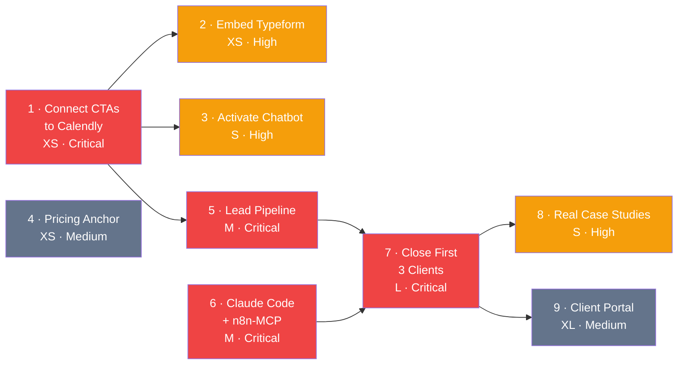

# Build Priority — Phoenix Automation

> Extracted from business-blueprint.json · 2026-03-13

9 build items across 4 types (process, agent, integration, content, product). Highest-impact items are small in effort — the first 4 items can be completed this week and unlock all revenue generation.

---

## Sprint 1 Recommendation

Do these first. All are XS or S effort. Together they make the website functional, the pipeline live, and the delivery system ready.

| # | Item | Type | Effort | Impact | Timing |
|---|------|------|--------|--------|--------|
| 1 | Connect CTA buttons to live Calendly booking page | process | XS | **Critical** | Today |
| 2 | Embed Typeform intake form before Calendly | process | XS | High | This week |
| 3 | Activate lead qualifier chatbot | agent | S | High | This week |
| 4 | Add pricing anchor to website | content | XS | Medium | This week |
| 5 | Set up outbound lead pipeline (Apollo + Instantly) | agent | M | **Critical** | Week 2 |

---

## Full Build Priority

| Priority | Item | Type | Effort | Impact | Rationale | Depends On |
|----------|------|------|--------|--------|-----------|------------|
| **1** | Connect CTA buttons to live Calendly booking page | process | XS | Critical | The website cannot generate a single lead without this. Both 'Get Free Assessment' buttons are currently decorative. 15-minute fix that unlocks all revenue. | — |
| **2** | Embed Typeform intake form before Calendly step | process | XS | High | Pre-qualifies every lead before the call. Feeds Airtable automatically. Saves 10 min per assessment and enables the lead-scorer agent. | Item 1 |
| **3** | Activate lead qualifier chatbot on website | agent | S | High | Qualifies inbound visitors 24/7 and routes hot leads to Calendly. Claude API + 3-question prompt. Inbound channel is dead without it. | Item 1 |
| **4** | Add pricing anchor to website | content | XS | Medium | Removes the largest pre-call objection. 'Projects start from $1,500' or a 3-tier card. Visitors leave when they cannot gauge affordability. | — |
| **5** | Set up outbound lead pipeline (Apollo + Instantly) | agent | M | Critical | Outbound is the primary revenue driver pre-referral. Apollo list (100–200 contacts), Claude writes email copy, Instantly sends. Target: 30 outreaches/day. | Item 1 |
| **6** | Install Claude Code + n8n-MCP and run test build | integration | M | Critical | The core operational advantage of the agency. Must be installed, connected, and proven end-to-end before signing the first client. Enables 4–6× build capacity. | — |
| **7** | Close first 3 clients and deliver exceptional results | process | L | Critical | Generates first revenue, real case studies, and proof that the delivery model works. Use personal network and early pipeline. | Items 5, 6 |
| **8** | Replace website placeholder case studies with real client outcomes | content | S | High | Social proof is the strongest website conversion lever. Cannot be done until first deliveries complete. | Item 7 |
| **9** | Build client portal (Lovable or Bubble + Airtable API) | product | XL | Medium | ClickUp shared links are sufficient until 5+ active clients. Build only after delivery is proven and client volume justifies investment. | Item 7 |

---

## Dependency Order

**Color key:** 🔴 Critical impact · 🟡 High impact · ⬜ Medium impact

---

## Effort & Impact Summary

| Effort | Items | Notes |
|--------|-------|-------|
| XS (< 1 day) | 1, 2, 4 | All three can be done today |
| S (1–3 days) | 3, 8 | Chatbot this week; case studies after first clients |
| M (1–2 weeks) | 5, 6 | Both in parallel during Week 2 |
| L (4–8 weeks) | 7 | First 3 clients over Month 1–2 |
| XL (2+ months) | 9 | Month 3+ once delivery is proven |
