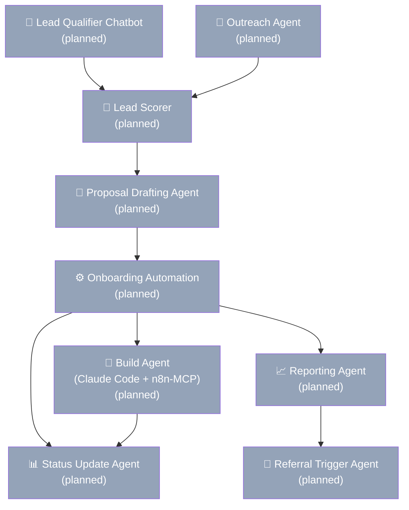

# Phoenix Automation — Business Blueprint

> Schema v1.0.0 · Status: Draft · Last updated: 2026-03-13
> Business type: AI Automation Agency · Stage: Pre-revenue

---

## TL;DR

- **What:** Done-for-you AI workflow automation for ops-heavy SMBs — built with Claude Code + n8n-MCP in under an hour per workflow instead of 3–5 hours manually
- **Who:** Operations managers and founders at 10–200 person e-commerce, professional services, and healthcare businesses drowning in manual repetitive tasks
- **How:** Free assessment (the sales call) → paid build ($1,500–$7,000) → monthly retainer ($500–$1,500/mo) — fully async delivery, clients own all credentials
- **Edge:** The build agent (Claude Code + n8n-MCP) creates a 4–6× capacity advantage over any manual n8n builder — the agency can serve more clients without more headcount
- **Now:** Site cannot generate revenue until CTA buttons connect to Calendly — fix today, then activate chatbot and launch outbound pipeline this week

> ⚠️ **Needs input:** Proof points and client case studies are placeholders. Replace after first 1–2 client deliveries.

---

## Business

Phoenix Automation helps businesses eliminate manual processes by identifying operational inefficiencies and implementing AI-powered workflows that run automatically. The model is simple: free assessment to earn trust, paid build to deliver value, monthly retainer to sustain the relationship. The agency runs on a minimal team with Claude and n8n as the operational core.

| | |
|--|--|
| **Tagline** | Transform Your Business With Intelligent Automation |
| **Location** | Clearwater, FL / Da Nang, Vietnam (remote-first) |
| **Model** | AI-First · Minimal Team |
| **Core Tools** | Claude · n8n · ClickUp |
| **Stage** | Pre-revenue |
| **Prepared** | March 2026 |

---

## Market & ICP

Phoenix Automation targets four primary segments, all sharing the same core pain: paying people to do things that machines should handle.

### Target Segments

| Segment | Description |
|---------|-------------|
| **E-commerce Brands** | Online retailers drowning in manual order management, inventory updates, customer comms, and fulfilment ops |
| **Professional Services** | Law firms, financial advisors, consultancies paying staff for intake, document processing, scheduling, and reporting |
| **Healthcare Admin** | Practices with appointment scheduling, patient comms, billing reconciliation overhead |
| **SMBs with Repetitive Ops** | Any 10–200 person business paying staff to do repetitive tasks that should be automated |

### Ideal Client Profile

**Best-fit client:** Operations manager or founder at a 10–200 person business who is actively paying staff to do repetitive manual work, knows it's a problem, and is open to technology — but isn't a developer.

| | |
|--|--|
| **Role** | Operations Manager, Founder, or Business Owner |
| **Company size** | 10–200 employees |
| **Industries** | E-commerce, professional services, healthcare, logistics, marketing agencies |
| **Geographies** | United States, Australia, UK, Remote/Global |

**Trigger events that cause them to seek help:**
- Hiring more staff to handle volume that should be automated
- Manually copying data between platforms every day
- Losing 10+ hours per week to repetitive admin with no strategic value
- Growth stalling because operations can't scale with team size
- Recent failed attempt to use off-the-shelf tools that didn't fit their workflow

**Disqualifiers:**
- Fewer than 10 employees — ROI is too thin
- Unwilling to own their own API accounts
- Expects AI to fully replace human judgment with no oversight

### Pain Points

1. Paying staff for repetitive tasks that create no strategic value
2. Manual data entry between disconnected tools causing errors and delays
3. No operational visibility without pulling manual reports
4. Unable to scale revenue without proportionally growing headcount
5. Spending 3–5 hours/week on follow-ups, status updates, and scheduling

### Competitors

| Competitor | How Phoenix Automation Wins |
|-----------|---------------------------|
| Freelance n8n / Zapier builders | Claude Code + n8n-MCP builds in 30–60 min vs. 3–5 hours — faster delivery, lower cost, self-healing workflows |
| Traditional software agencies | No custom code, no lock-in — clients own all credentials and docs. Faster, cheaper, async-first |
| Off-the-shelf tools (Zapier, Make) | Done-for-you with Claude AI baked in — not a tool clients have to learn and maintain |

---

## Services

The service model follows a simple funnel: free assessment earns trust → paid build delivers value → retainer sustains the relationship.

### What We Sell

| Service | Delivery | Price | Best For |
|---------|----------|-------|----------|
| **Free Assessment** | 30-min call | Free | Lead gen — always ends with a proposal |
| **Starter Build** | 1–2 automations | $1,500–$3,000 | First-time clients testing AI |
| **Growth Package** | 3–5 workflows | $3,000–$7,000 | Ops-heavy SMBs ready to scale |
| **Agency Retainer** | Monthly monitoring | $500–$1,500/mo | Ongoing revenue backbone |

> **Key rule:** The free assessment IS the sales call. Never deliver one without presenting next steps. Always end with a proposal outline.

> **Key rule:** Think contractor model — agency brings tools and expertise, client pays for materials (their own API accounts, $50–$300/mo typical).

### Service Detail

**Free Business Assessment**
A 30-minute consultation identifying 3–5 automation opportunities and calculating rough ROI. This is the trust-builder and the sales entry point — Typeform pre-qualifies the lead before the call so the owner arrives briefed. Claude pre-scores every submission automatically.

**Starter Build ($1,500–$3,000)**
1–2 automations built with Claude Code + n8n-MCP. Client receives Loom walkthrough — no live training session. Ideal for first-time clients who want to see results before committing to a larger engagement (e.g. lead qualifier + CRM auto-update).

**Growth Package ($3,000–$7,000)**
3–5 workflow automations with custom Claude AI integrations. Full deployment, testing, and a Loom training library. The most common engagement. Targets clients ready to automate their highest-volume manual processes at scale.

**Agency Retainer ($500–$1,500/mo)**
Monthly monitoring, bug fixes, new automations, and a Claude-generated performance report from n8n execution data. Converts one-time builds into ongoing relationships — the recurring revenue backbone of the agency.

---

## Value Proposition

Phoenix Automation's core promise is speed, ownership, and ROI — not a generic "we use AI."

**Headline:** We replace your manual operations with AI workflows in under a week — starting with a free assessment that always ends with a concrete ROI estimate.

**Why clients choose Phoenix Automation:**
1. **Speed advantage:** Claude Code + n8n-MCP builds workflows in 30–60 min vs. 3–5 hrs manually — enabling 4–6× more client capacity without headcount
2. **Zero purchase risk:** Free assessment removes the barrier to entry and pre-proves ROI before the first dollar is spent
3. **No lock-in:** Clients own all API credentials and workflow docs — clean break if they ever leave, no vendor disputes
4. **Async-first delivery:** Proposals, training, and status updates are all automated — premium experience with minimal founder hours per client
5. **Self-healing automations:** Claude Code detects and self-corrects n8n errors automatically, reducing retainer support load

**Positioning:** For SMB operations managers and founders paying people to do repetitive tasks, Phoenix Automation provides done-for-you AI workflow automation — unlike freelancers who build and disappear or software agencies that lock you into custom code you can't own.

> ⚠️ **Needs input:** Proof points are placeholders. Replace `[TO BE CONFIRMED]` with real client case studies after first 1–2 deliveries.

---

## Tech Stack

The agency runs on a small, deliberate set of tools. Every tool has one specific job.

| Tool | Job | Cost |
|------|-----|------|
| **Claude (Anthropic)** | AI brain — chatbot, proposals, emails, reports, builds via Claude Code | $20/mo or pay-per-use |
| **n8n** | Automation backbone — all client workflow automations | $0 (self-hosted) or ~$20/mo |
| **n8n-MCP** | Bridge giving Claude Code access to 1,084+ n8n node schemas via API | Open source (npm) |
| **ClickUp** | Project management — one Space per client, assessment to retainer | $0–$10/mo |
| **Airtable** | Client database — single source of truth, n8n reads/writes automatically | Free tier initially |
| **Apollo.io** | Lead prospecting — bulk export by industry, company size, job title | Subscription |
| **Instantly.ai** | Cold email sequences — Claude-written, automated, inbox health management | Subscription |
| **Typeform** | Intake & pre-assessment — 5 questions, auto-posts to Airtable via n8n | Free tier |
| **Loom** | Async client training — replaces live walkthrough calls | Free tier |
| **Calendly** | All scheduling — no manual coordination | Free / paid |

**Primary LLM:** `claude-sonnet-4-6`
**Fallback LLM:** `claude-haiku-4-5`
**Orchestration:** Claude Code + n8n-MCP (czlonkowski/n8n-mcp)

### What AI Handles vs. What Needs a Human

| AI Handles (Fully Automated) | Human Required |
|------------------------------|----------------|
| Cold outreach — Claude writes, Instantly sends | Assessment / sales calls (30 min per prospect) |
| Lead qualification — chatbot on website, 24/7 | Final proposal review before sending |
| Booking — Calendly, no manual scheduling | Complex build architecture decisions |
| Proposal drafting — Claude from call notes | Client relationship management and upsells |
| Follow-up sequences — 3-step cadence | |
| Weekly status updates — from ClickUp | |
| Monthly reports — Claude from n8n data | |
| Invoicing — triggered on milestone or date | |

### Credentials Model (Who Pays for What)

| Phoenix Automation Pays | Client Pays (Their Own Accounts) |
|--------------------------|----------------------------------|
| n8n (self-hosted or cloud) | Anthropic API key |
| Claude Code subscription | CRM / email platform (HubSpot, Mailchimp) |
| ClickUp | Any SaaS tools being automated |
| Apollo.io + Instantly.ai | Website chatbot hosting |
| Airtable | API usage costs (~$50–$300/mo) |

**Credentials handoff process:** Client creates API key → Sends via 1Password or encrypted form → Added to n8n client folder only → Claude Code builds referencing template → Live automation billed to client. Zero risk of credentials crossing between projects.

---

## Operations

### Client Intake (8 Steps)

| # | Stage | What Happens | Tools |
|---|-------|-------------|-------|
| 1 | Discovery | Client finds Phoenix Automation via ad, referral, LinkedIn, or website | Website + Calendly |
| 2 | Intake Form | Client fills 5-question Typeform before booking — Claude pre-scores lead automatically | Typeform + Claude |
| 3 | Assessment Call | 30-min call: identify 3–5 automation opportunities, calculate ROI — this IS the sales call | Zoom / Meet |
| 4 | Proposal | Within 24 hrs: Claude drafts proposal from call notes, owner reviews and sends | Claude + Notion |
| 5 | Onboarding | Client signs and pays — ClickUp project and API key collection trigger automatically | ClickUp + n8n |
| 6 | Build | Claude Code + n8n-MCP builds workflows. Weekly auto-status updates from ClickUp | Claude Code + n8n |
| 7 | Launch & Handoff | Automations go live. Client receives Loom walkthroughs — no live training | Loom + n8n |
| 8 | Retainer | n8n monitors, Claude generates monthly report, referral sequence triggers at 30 days | n8n + Claude |

**Methodology:** Blueprint-first, async delivery — no live check-ins, no manual status updates.

**CRM:** Airtable (Typeform auto-posts, n8n reads/writes, single source of truth)

**Project management:** ClickUp — one Space per client. Shared read-only links replace a custom client portal until 5+ active clients.

### Key SOPs

1. **Credentials handoff** — client-owned API keys, 1Password transfer, per-client n8n folder, credentials template
2. **Assessment call framework** — identify 3–5 processes, calculate ROI, always close with proposal outline
3. **Proposal rule** — every proposal clearly states client pays their own API costs ($50–$300/mo)
4. **Referral SOP** — automated email sequence at 30 days post-launch via n8n (never ask manually)
5. **AI boundary rule** — Claude handles cold outreach, lead scoring, proposals, status, reports; human handles calls, final review, architecture, and relationships

---

## Pricing

**Model:** Hybrid (productized builds + monthly retainer)

| Tier | Inclusions | Price | Target |
|------|-----------|-------|--------|
| **Free Assessment** | 30-min call, 3–5 opportunities ID'd, ROI calc, proposal outline | Free | All inbound/outbound leads |
| **Starter Build** | 1–2 live workflows, Loom walkthrough, ClickUp tracking | $1,500–$3,000 | First-time AI clients |
| **Growth Package** | 3–5 workflows, Claude AI integrations, Loom library, ClickUp docs | $3,000–$7,000 | SMBs ready to scale |
| **Agency Retainer** | n8n monitoring, monthly report, bug fixes, new automations | $500–$1,500/mo | Build clients → ongoing |

---

## Team

The agency is designed to run lean — Claude and n8n handle all repeatable work, freeing the founder to focus on assessment calls, architecture decisions, and relationships.

| Role | Count | Type | Responsibilities |
|------|-------|------|-----------------|
| Founder / Agency Owner | 1 | Founder | Assessment calls, final proposal review, complex architecture, client relationships, upsells |

**Hiring plan (VAs, only if needed):**

| Role | Trigger |
|------|---------|
| Outreach VA | When Apollo list management exceeds founder's available time |
| Delivery VA | When 5+ concurrent projects need simpler n8n workflows built |
| Support VA | When client portal launches and ticket volume requires dedicated response |

---

## Financials

| | |
|--|--|
| **Current MRR** | $0 (pre-revenue) |
| **3-month MRR target** | ⚠️ [TO BE CONFIRMED] — define after closing first 2 clients |
| **12-month MRR target** | ⚠️ [TO BE CONFIRMED] — define after closing first 2 clients |
| **12-month client target** | 10 active retainer clients |
| **Runway** | ⚠️ [TO BE CONFIRMED] |

**Agency cost structure:**
- Claude Code: ~$20/mo or pay-per-use
- n8n: $0 (self-hosted) or ~$20/mo
- ClickUp: $0–$10/mo
- Apollo.io + Instantly.ai: subscription (lead gen)
- Airtable: free tier initially
- Loom: free tier initially

---

## Agent Map

The agency's internal AI agent ecosystem. 9 agents planned; 0 currently live. Build order driven by revenue impact.

See `agent-map.md` for full agent inventory and detail.

---

## KPIs

### Operational

| Metric | Target | Frequency |
|--------|--------|-----------|
| Prospects contacted per day (automated outreach) | 30–50 | Daily |
| Assessment calls booked per week | 5+ | Weekly |
| Build time per automation workflow | < 1 hour | Per project |
| Proposal turnaround from assessment call | < 24 hours | Per project |

### Financial

| Metric | Target | Frequency |
|--------|--------|-----------|
| Monthly Recurring Revenue (MRR) | ⚠️ [TO BE CONFIRMED] | Monthly |
| Active retainer clients | 10 within 12 months | Monthly |
| Assessment-to-paid-build conversion rate | > 30% | Monthly |

### Client Success

| Metric | Target | Frequency |
|--------|--------|-----------|
| Client automation uptime | > 99% (n8n monitoring) | Monthly |
| Hours saved per client per week | > 10 hours | Monthly |
| Referral rate | 1 per client within 60 days | Per client |

---

## Assumptions

See `assumptions-and-gaps.md` for the full risk register with validation methods.

| # | Assumption | Validated? |
|---|-----------|------------|
| 1 | Free assessment + proposal model converts at > 30% | No |
| 2 | Claude Code + n8n-MCP builds production workflows reliably in < 1 hour | No |
| 3 | SMB clients accept the credential ownership model without friction | No |
| 4 | 30–50 automated outreaches/day generates 2+ client closes per month | No |
| 5 | Async delivery (Loom, no live calls) accepted by clients paying $1,500–$7,000 | No |

---

## Gaps

See `assumptions-and-gaps.md` for the full gap register with severities and resolutions.

| Severity | Gap |
|----------|-----|
| 🔴 BLOCKING | CTA buttons not connected to Calendly — site cannot generate revenue |
| 🟠 HIGH | Website chatbot not activated |
| 🟠 HIGH | Typeform intake form not embedded on website |
| 🟠 HIGH | Claude Code + n8n-MCP not installed or tested |
| 🟠 HIGH | No real client case studies on website |
| 🟡 MEDIUM | MRR targets not defined |
| 🟡 MEDIUM | No pricing anchor on website |
| 🟡 MEDIUM | Agency Retainer scope not defined |
| 🟡 MEDIUM | Privacy Policy and ToS pages empty |
| ⚪ LOW | No SLA defined for after-hours automation failures |

---

## Next Actions

Derived from `build-priority.md` — do these in order.

| # | Action | Effort | Impact | Timing |
|---|--------|--------|--------|--------|
| 1 | **Connect CTA buttons to live Calendly booking page** | XS | Critical | Today |
| 2 | **Embed Typeform intake form before Calendly** | XS | High | This week |
| 3 | **Activate lead qualifier chatbot** | S | High | This week |
| 4 | **Add pricing anchor to website** | XS | Medium | This week |
| 5 | **Set up outbound lead pipeline (Apollo + Instantly)** | M | Critical | Week 2 |
